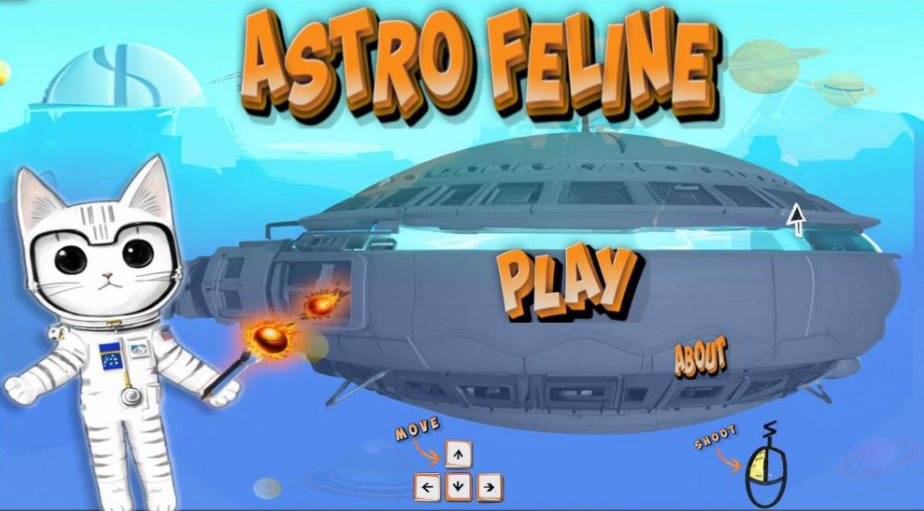
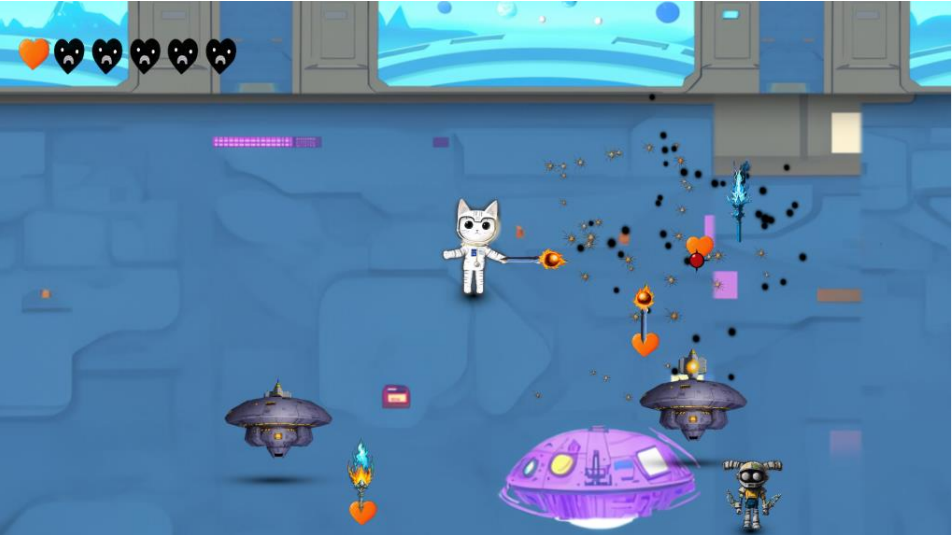
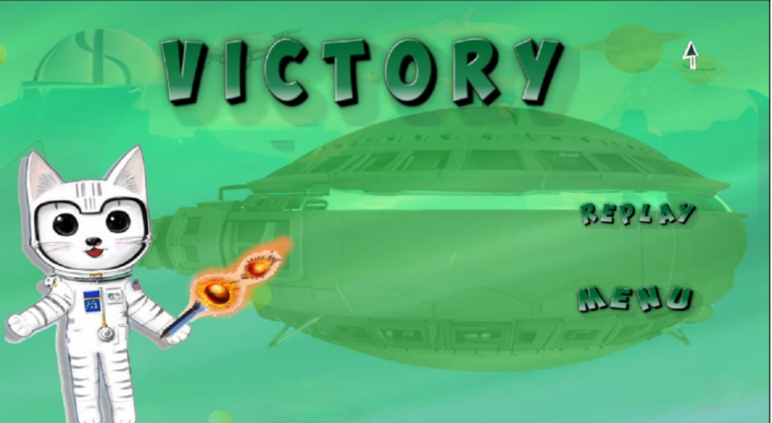
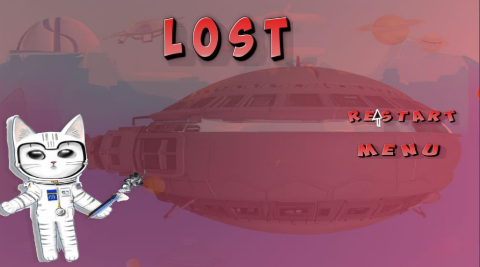
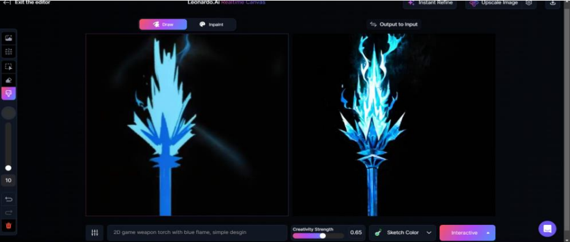
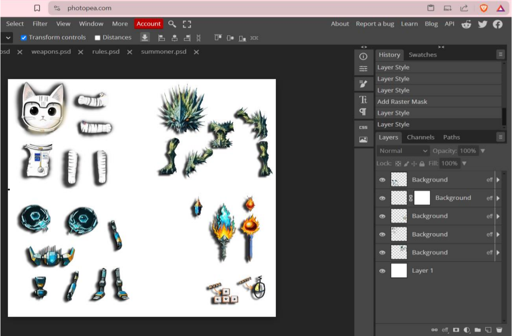
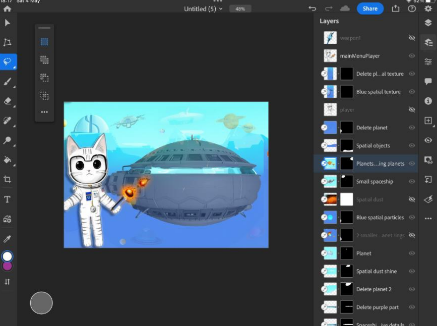

# Astro Feline 🚀🐱

Excited to announce my latest project: **Astro Feline**, a top-down shooter game developed in Unity 2D!

**Astro Feline** combines cutting-edge technologies and creative design to deliver an engaging gaming experience. Here are some of the key technologies and tools utilized in this project:

- **C#** for scripting, game logic, and object-oriented programming
- **Leonard.ai** for AI-generated character design
- **Suno.ai** for dynamic soundscapes
- **Optimizer.ai** for sound effects
- **Photoshop** for stunning visual assets
- **Audacity** for immersive audio effects
- **Unity Animator** for smooth animations
- **State Machine** within Unity Animator for dynamic transitions and communication between different object states
- **Unity Rigidbody2D** for realistic physics
- **Unity BoxCollider2D** for precise collision detection

This entire project was built from the ground up, and it was a fun experience. One of the most interesting aspects was leveraging the State Machine in Unity Animator to ensure seamless transitions and interactions between different states of game objects, adding a layer of depth and realism to the gameplay.

I am thrilled to share this journey with the community and look forward to your feedback. 🚀

## Technologies and Tools

- **C#**
- **Leonard.ai**
- **Suno.ai**
- **Optimizer.ai**
- **Photoshop**
- **Audacity**
- **Unity Animator**
- **State Machine**
- **Unity Rigidbody2D**
- **Unity BoxCollider2D**

## Features

- Top-down shooter gameplay
- AI-generated character designs
- Dynamic and immersive soundscapes
- Stunning visual assets and effects
- Realistic physics and precise collision detection

## Development Highlights

- Built from the ground up in Unity 2D
- Utilized State Machine for smooth transitions and interactions
- Engaging and fun gameplay experience

Feel free to check out the project and share your thoughts!

## Contact

For any questions or feedback, reach out or follow me on https://www.linkedin.com/in/andreea-chiri%C8%9B%C4%83-723186253/.

---
*Thank you for your support!*
